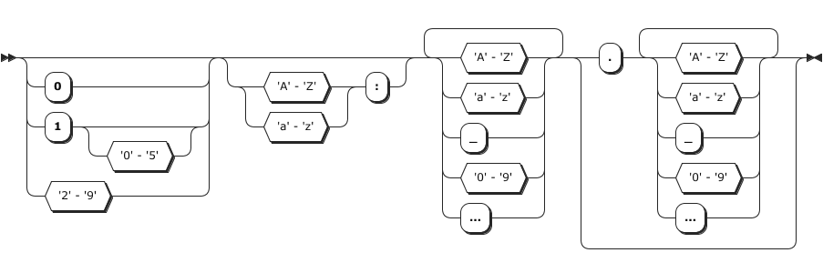
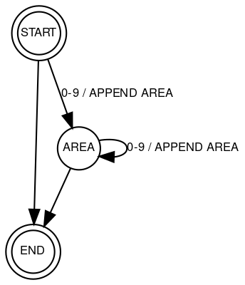
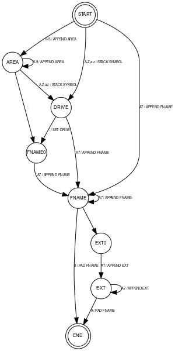

# Z80 Automata Implementation

Hi there. You're probably interested in Z80, final state machines, or CP/M if you are here. Then, you've come to the right place. In this example of a non-trivial Z80 finite state machine, we are implementing an extended CP/M path parser.

 > Just what exactly is an extended CP/M path? It is a CP/M filename with an extension that includes the CP/M area and drive. For example, 2A:TEST.DAT.

Using the FSM for this task may not be optimal, but our objective is to demonstrate the technique. After that, you can use it to implement more complex tasks, such as the standard C printf function or a programming language tokenizer.

# Syntax and Semantic Analysis

Here's the syntax diagram.

A valid path also respects two additional semantic rules:

 * Filename and extension are 7 bit ascii strings and cannot contain any of the following: < > . , ; : = ? * [ ] % | ( ) / \. 
 * Max length for the filename is 8 and for extension 3. 

## Introducing the Automata

Our approach is to convert the parsing task into a [Mealy machine](https://en.wikipedia.org/wiki/Mealy_machine). Our input will be character and current state, and our output a call to function to do something with it.

This is the partial mealy machine for parsing the area at the beginning of the path.

We start in the `START` state and read the first symbol. Then, we call the function `APPEND AREA` and move to the `AREA` state if it is a digit. If it is not a digit, there is no area, and we move to the `END` state. We persist in the `AREA` state as long as digits are available. We move to the 'END' state if we encounter anything else.

 > In case of any unexpected symbol, we trigger an error.

This machine will take any number from the start of a string, but it will not perform the semantic check. An excellent place to do that is the `APPEND AREA` function. 

### Encoding the Automata

To implement this in the Z80 assembly we need an automata function with the table of states and transitions, a function to check if a symbol is a digit and the `APPEND AREA` function.

We could create an adjacment matrix for state transitions, but this would be memory hungry. So our transitions will be a simple row of data:

~~~
<start>, <test>, <function>, <end>
~~~

Our automata can then be written as

~~~
fpa_automata:
        .db     S_START + T_DIGIT,      S_AREA + F_APPEND_AREA
        .db     S_START + T_ALPHA,      S_DRIVE + F_STACK_SYM
        .db     S_START + T_ASCII7,     S_FNAME + F_APPEND_FNAME
        .db     S_AREA + T_DIGIT,       S_AREA + F_APPEND_AREA
        .db     S_AREA + T_COLON,       S_FNAME0 + F_NONE
        .db     S_AREA + T_ASCII7,      S_DRIVE + F_STACK_SYM
        .db     S_DRIVE + T_COLON,      S_FNAME0 + F_SET_DRV
        .db     S_DRIVE + T_ASCII7,     S_FNAME + F_APPEND_FNAME
        .db     S_FNAME0 + T_ASCII7,    S_FNAME + F_APPEND_FNAME
        .db     S_FNAME + T_ASCII7,     S_FNAME + F_APPEND_FNAME
        .db     S_FNAME + T_ZERO,       S_END + F_NONE
        .db     S_FNAME + T_DOT,        S_EXT0 + F_NONE
        .db     S_EXT0 + T_ASCII7,      S_EXT + F_APPEND_EXT
        .db     S_EXT + T_ASCII7,       S_EXT + F_APPEND_EXT
        .db     S_EXT + T_ZERO,         S_END + F_NONE
efpa_automata:
~~~

An empty test always succeeds, and an empty function means no function. Depending on number of states, tests, and functions we can generate quite economic table for our automata. In the above case we only need three states which can be encoded in 2 bits, we only need two function calls which require 1 bit. And one test which requires 1 bit. Hence our row for describing a transiaiton is 2 + 1 + 1 + 2 = 6 bits. The entire automata takes 3 bytes.

### The Complete Automata

So now we know how we'll encode the automata. It is time to create the real automata that we will use for the task.

We have a total of 8 states which we can encode with 3 bits. There are less then 8 functions which requires additional 3 bits. And there are 6 tests which require 3 bits. So let's write our automata into a comfortable 2 bytes per transitio or 28 bytes for all 14 transitions.

### Test Functions

Our test function will accept the symbol in the `A` register and return result in the zero flag. Since we have a lot of interval testing (A-Z, 0-9), our first test function will test if character in withing bounds of register DE. The actual test will be D >= A >= E.

~~~asm
        ;; test if a is within DE: D >= A >= E
        ;; input(s):
        ;;  A   value to test
        ;;  DE   interval
        ;; output(s):
        ;;  Z    zero flag is 1 if inside, 0 if outside
        ;; affects:
        ;;  C, D, E, flags
test_inside_interval:
        ld      c,a                     ; store a
        cp      e			            ; a=a-e
        jr      nc, tidg_possible	    ; a>=e       
        jr      tidg_false              ; false
tidg_possible:
        cp      d                       ; a=a-d
        jr      c,tidg_true		        ; a<d
        jr      z,tidg_true             ; a=d
        jr      tidg_false
tidg_true:
        ;; set zero flag
        xor     a                       ; a=0, set zero flag
        ld      a,c                     ; restore A
        ret
tidg_false:
        ;; reset zero flag
        xor     a
        cp      #0xff
        ld      a,c
        ret
~~~

Now we can derive our tests by simply populating DE and A and calling this function. 

~~~asm
test_is_digit:
	    ld      de,#0x3930	            ; d='9', e='0'
        jr      test_inside_interval    ; ret optimization...
~~~

The `ret` optmization means that we jump on the test and when it returns it will go
directly to the calee so we save one call.

In addition to that, returning values in flags is a *superoptimization* enabler. We can now chain calls like this.

~~~asm
test_is_alpha:
        call    test_is_upper
        ret     z
        jr      test_is_lower

test_is_upper:
        ld      de,#0x5a41              ; d='Z'. e='A'
        jr      test_inside_interval

test_is_lower:
        ld      de,#0x7a61              ; d='z', e='a'
        jr      test_inside_interval    ; last tests' result is the end result

test_is_alphanumeric:
        call    test_is_digit
        ret     z
        jr      test_is_alpha
~~~

Functionally these tests are equal to a `CP` call - they take same input and return same output. Therefore they can nicely be mixed in a chain with this instruction. 

### Automata Engine

The automata engine will accept `HL`, pointing to the path, `DE` pointing to the FCB structure, and `BC` pointing to the area byte to fill. It will fill the first three fields of the FCB strucure: `drive`, `filename` and `filetype` and return success or error. Here's the C call to the parse function.

~~~cpp
extern uint8_t fparse(char *path, fcb_t *fcb, uint8_t *area);
~~~

Let's write assembler code for this function.

~~~asm
        .area   _CODE
_fparse::
        ;; fetch args from stack
        pop     af                      ; ignore the return address...
        pop     hl                      ; pointer to path to hl
        pop     de                      ; pointer to fdb to de
        pop     bc                      ; pointer to area to bc
        ;; restore stack and make iy point to it
        ld      iy,#-8
        add     iy,sp
        ld      sp,iy
        ;; we will use space from 2(iy) to 7(iy) as
        ;; local variables ... overwriting arguments
        ;; 2(iy) ... current state
        ;; 3(iy) ... error code
        ld      2(iy),#0                ; initial state to 2(iy)!
        ld      3(iy),#0                ; status code is 1 (UNEXPECTED EOS)
fpa_nextsym:
        ;; get next symbol
        ld      a,(hl)
        cp      #0                      ; end of string?
        jr      z,fpa_done
        push    hl                      ; store hl!
        ;; find transition
        call    fpa_findtran
        ;; if not found then unexpected error
        jr      nz,fpa_done
        ;; else transition function id is in l
        call    fpa_execfn
        jr      nz,fpa_done             ; if not zero then status!
        ;; loop
        pop     hl                      ; restore hl
        inc     hl                      ; next symbol
        jr      fpa_nextsym             ; and loop
        ;; execute function in l
fpa_execfn:
        ld      h,a                     ; store a
        ld      a,l
        cp      #FPAFN_NONE
        jr      z,fpafn_nofun           ; there is no function!
        cp      #FPAFN_APPEND_AREA
        call    z,fpafn_append_area
        cp      #FPAFN_APPEND_FNAME
        call    z,fpafn_append_fname
        ;; if we are here, the function is invalid
        ld      3(iy),#INVALID_FN       ; invalid function error
        xor     a
        cp      #1                      ; reset z flag
        ret
fpafn_nofun:
        xor     a                       ; everything's allright!
        ret
        ;; report status and quit!
fpa_done:
        pop     hl                      ; restore hl
        ld      h,l                     ; char position to h
        ld      l, 3(iy)                ; error/success code to l
        ret

        ;; function: append area
fpafn_append_area:
        ld      a,h                     ; get char to a
        ret

fpafn_append_fname:
        ld      a,h
        ret

fpafn_pad_fname:
        ret

fpafn_append_ext:
        ld      a,h
        ret

fpafn_pad_ext:
        ret

fpafn_set_drive:
        ld      a,h
        ret

fpath_stack_symbol:
        ld      a,h
        ret

        .area   _CODE
fpa_fsm:
        .db     0,0
        .db     0,0
        .db     0,0
efpa_fsm_end:
~~~